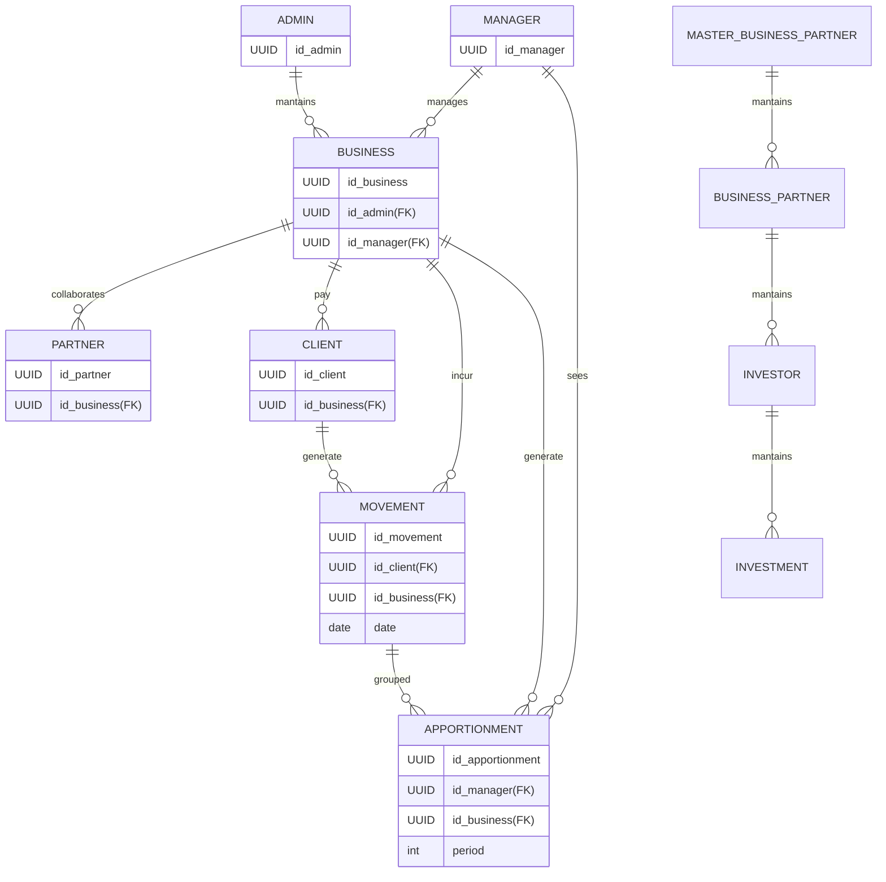
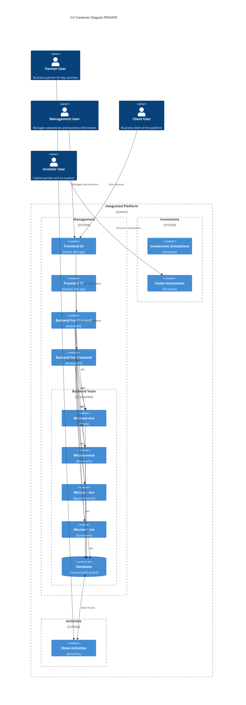

# Architecture Integrated Platform

## I. Modelo Entidad-Relación

```mermaid
erDiagram
    ADMIN ||--o{ BUSINESS : mantains
    BUSINESS ||--o{ PARTNER : collaborates
    BUSINESS ||--o{ CLIENT : pay
    PARTNER
    MANAGER ||--o{ BUSINESS : manages
    CLIENT ||--o{ MOVEMENT : generate
    BUSINESS ||--o{ MOVEMENT : incur
    BUSINESS ||--o{ APPORTIONMENT : generate
    MOVEMENT ||--o{ APPORTIONMENT : grouped
    MANAGER ||--o{ APPORTIONMENT : sees
    ADMIN {
        UUID id_admin
    }
    MANAGER {
        UUID id_manager
    }
    BUSINESS {
        UUID id_business
        UUID id_admin(FK)
        UUID id_manager(FK)
    }
    PARTNER {
        UUID id_partner
        UUID id_business(FK)
    }
    APPORTIONMENT{ 
        UUID id_apportionment
        UUID id_manager(FK)
        UUID id_business(FK)
        int period
    }
    CLIENT {
        UUID id_client
        UUID id_business(FK)
    }
    MOVEMENT {
        UUID id_movement
        UUID id_client(FK)
        UUID id_business(FK)
        date date
    }

    INVESTOR ||--o{ INVESTMENT : mantains
    BUSINESS_PARTNER ||--o{ INVESTOR : mantains
    MASTER_BUSINESS_PARTNER ||--o{ BUSINESS_PARTNER : mantains
```

## II. C4 model

### Context Diagram (level 1)

```mermaid
C4Context
    title C4 Context Diagram
    
    Person(p_partner, "Partner User", "Business partner for key activities")
    Person(p_mgmt, "Management User", "Manages operational and business information")
    Person(p_client, "Client User", "Business client of the platform")
    Person(p_investor, "Investor/BP/MBP User", "Capital partner and co-investor")
    Person_Ext(p_web, "Web User", "Anonymous visitor of the public website")

    Boundary(b_system, "Integrated Platform") {

        System(sys_public_web, "Public Website", "Public-facing website")
        Rel(p_web, sys_public_web, "Browses")

        System(sys_activities, "Activities System", "Business activities coordination")
        Rel(p_partner, sys_activities, "Collaborates")
        Rel(sys_activities, sys_management, "Sends activity updates")

        System(sys_management, "Management System", "Operational and administrative management")
        Rel(p_client, sys_management, "Uses services")
        Rel(p_mgmt, sys_management, "Manages and monitors")

        System(sys_investments, "Investments System", "Investment and portfolio management")
        Rel(p_investor, sys_investments, "Consults investments")
        Rel(sys_investments, sys_management, "Sends investments reports")

        System_Ext(ext_data_api, "Data Indicators API", "External data provider")
        Rel(sys_public_web, ext_data_api, "Requests data")
    }
```

### Container Diagram (level 2)

#### PUBLIC

```mermaid
C4Container
    title C4 Container Diagram PUBLIC

    Person_Ext(p_web, "Web User", "Anonymous visitor of the public website")
    Boundary(b_system, "Integrated Platform") {
        System_Boundary(b_public,"Public Website"){
            Container(c_investment, "Investments info", "Serverless")
            Container(c_home, "Landing page", "Serverless")
            Rel(p_web, c_home, "Browses")
            Rel(c_home, c_investment, "Navegate")
        }
        System_Boundary(b_ext,"External"){
            System_Ext(ext_data_api, "Data Indicators API", "External data provider")
            Rel(c_home, ext_data_api, "Requests data")
        }
    }
```

#### PRIVATE

```mermaid
C4Container
    title C4 Container Diagram PRIVATE
    Person(p_partner, "Partner User", "Business partner for key activities")
    Person(p_mgmt, "Management User", "Manages operational and business information")
    Person(p_client, "Client User", "Business client of the platform")
    Person(p_investor, "Investor User", "Capital partner and co-investor")

    Boundary(b_system, "Integrated Platform") {
        System_Boundary(b_management,"Management"){
            Container(c_mui, "Frontend UI", "Mobile Web App")
            Rel(p_mgmt, c_mui, "Manages and monitors")
            Rel(p_client, c_mui, "Uses services")
            Container(c_dui, "Frontend UI", "Desktop Web App")
            Container(c_mbff, "Backend For Frontend", "Mobile BFF")
            Rel(c_mui, c_mbff, "Consults investments")

            Container(c_dbff, "Backend For Frontend", "Desktop BFF")
            Rel(c_dui, c_dbff, "Consults investments")

            Container_Boundary(b_backend, "Backend Team"){
                Container(c_clients, "Microservice", "Clients")
                Rel(c_dbff, c_clients, "API")
                Rel(c_mbff, c_clients, "API")

                Container(c_movements, "Microservice", "Movements")
                Rel(c_dbff, c_movements, "API")
                Rel(c_mbff, c_movements, "API")

                Container(c_apportionments, "Microservice", "Apportionments")
                Rel(c_dbff, c_apportionments, "API")
                Rel(c_mbff, c_apportionments, "API")

                Container(c_guarantees, "Microservice", "Guarantees")
                Rel(c_dbff, c_guarantees, "API")
                Rel(c_mbff, c_guarantees, "API")

            ContainerDb(db_system, "Database", "Transactional System")
            Rel(c_guarantees, db_system, "API")
            Rel(c_apportionments, db_system, "API")
            Rel(c_movements, db_system, "API")
            Rel(c_clients, db_system, "API")

            }
        }
        System_Boundary(b_investment,"Investment"){
            Container(c_simulations, "Investment simulations", "Serverless")
            Container(c_investment, "Home investment", "Serverless")
            Rel(p_investor, c_investment, "Consults investments")
        }
        System_Boundary(b_activities,"Activities"){
            Container(c_activities, "Show Activities", "Serverless")
            Rel(p_partner, c_activities, "Collaborates")
            BiRel(c_activities, db_system, "Data Access")
        }
    }
```
