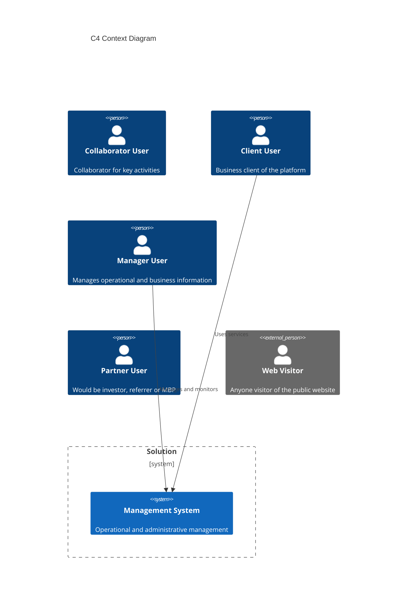

## C4 Context diagram: Integrated System

```mermaid
C4Context
    title C4 Context Diagram
    
    Person(p_partner, "Collaborator User", "Collaborator for key activities")
    Person(p_client, "Client User", "Business client of the platform")
    Person(p_mgmt, "Manager User", "Manages operational and business information")
    Person(p_investor, "Partner User", "Would be investor, referrer or MBP")
    Person_Ext(p_web, "Web Visitor", "Anyone visitor of the public website")

    Boundary(b_system, "Solution") {

        System(sys_management, "Management System", "Operational and administrative management")
        Rel(p_client, sys_management, "Uses services")
        Rel(p_mgmt, sys_management, "Manages and monitors")

    }
```

