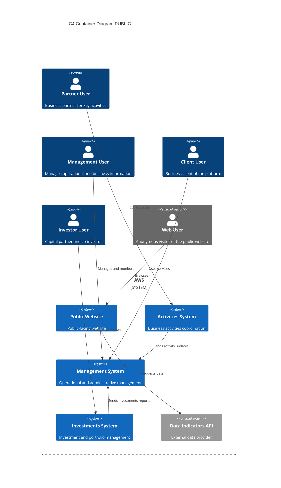

# Diseño de la solución: Plataforma integrada

## C4 Context Diagram (level 1)

```mermaid
C4Context
    title C4 Context Diagram
    
    Person(p_partner, "Partner User", "Business partner for key activities")
    Person(p_mgmt, "Management User", "Manages operational and business information")
    Person(p_client, "Client User", "Business client of the platform")
    Person(p_investor, "Investor User", "Capital partner and co-investor")
    Person_Ext(p_web, "Web User", "Anonymous visitor of the public website")

    System_Boundary(b_system, "AWS") {

        System(sys_public_web, "Public Website", "Public-facing website")
        Rel(p_web, sys_public_web, "Browses")

        System(sys_activities, "Activities System", "Business activities coordination")
        Rel(p_partner, sys_activities, "Collaborates")
        Rel(sys_activities, sys_management, "Sends activity updates")

        System(sys_management, "Management System", "Operational and administrative management")
        Rel(p_client, sys_management, "Uses services")
        Rel(p_mgmt, sys_management, "Manages and monitors")

        System(sys_investments, "Investments System", "Investment and portfolio management")
        Rel(p_investor, sys_investments, "Consults investments")
        Rel(sys_investments, sys_management, "Sends investments reports")

        System_Ext(ext_data_api, "Data Indicators API", "External data provider")
        Rel(sys_public_web, ext_data_api, "Requests data")
    }

```

## C4 Container Diagram (level 2)

### PUBLIC

```mermaid
C4Container
    title C4 Container Diagram PUBLIC

    Person(p_partner, "Partner User", "Business partner for key activities")
    Person(p_mgmt, "Management User", "Manages operational and business information")
    Person(p_client, "Client User", "Business client of the platform")
    Person(p_investor, "Investor User", "Capital partner and co-investor")
    Person_Ext(p_web, "Web User", "Anonymous visitor of the public website")

    System_Boundary(b_system, "AWS") {

        System(sys_public_web, "Public Website", "Public-facing website")
        Rel(p_web, sys_public_web, "Browses")

        System(sys_activities, "Activities System", "Business activities coordination")
        Rel(p_partner, sys_activities, "Collaborates")
        Rel(sys_activities, sys_management, "Sends activity updates")

        System(sys_management, "Management System", "Operational and administrative management")
        Rel(p_client, sys_management, "Uses services")
        Rel(p_mgmt, sys_management, "Manages and monitors")

        System(sys_investments, "Investments System", "Investment and portfolio management")
        Rel(p_investor, sys_investments, "Consults investments")
        Rel(sys_investments, sys_management, "Sends investments reports")

        System_Ext(ext_data_api, "Data Indicators API", "External data provider")
        Rel(sys_public_web, ext_data_api, "Requests data")
    }

```

### PRIVATE

```mermaid
C4Container
    title C4 Container Diagram PRIVATE

    Person(p_partner, "Partner User", "Business partner for key activities")
    Person(p_mgmt, "Management User", "Manages operational and business information")
    Person(p_client, "Client User", "Business client of the platform")
    Person(p_investor, "Investor User", "Capital partner and co-investor")
    Person_Ext(p_web, "Web User", "Anonymous visitor of the public website")

    System_Boundary(b_system, "AWS") {

        System(sys_public_web, "Public Website", "Public-facing website")
        Rel(p_web, sys_public_web, "Browses")

        System(sys_activities, "Activities System", "Business activities coordination")
        Rel(p_partner, sys_activities, "Collaborates")
        Rel(sys_activities, sys_management, "Sends activity updates")

        System(sys_management, "Management System", "Operational and administrative management")
        Rel(p_client, sys_management, "Uses services")
        Rel(p_mgmt, sys_management, "Manages and monitors")

        System(sys_investments, "Investments System", "Investment and portfolio management")
        Rel(p_investor, sys_investments, "Consults investments")
        Rel(sys_investments, sys_management, "Sends investments reports")

        System_Ext(ext_data_api, "Data Indicators API", "External data provider")
        Rel(sys_public_web, ext_data_api, "Requests data")
    }

```

