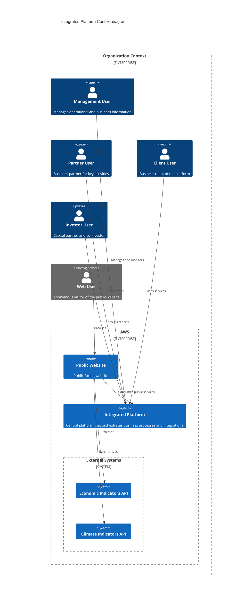

# Diseño de la solución: Plataforma integrada

## 1) C4 Context

```mermaid
C4Context
    title Integrated Platform Context diagram

    Enterprise_Boundary(b0, "Organization Context") {
        Person(p1, "Management User", "Manages operational and business information")
        Person(p2, "Partner User", "Business partner for key activities")
        Person(p3, "Client User", "Business client of the platform")
        Person(p4, "Investor User", "Capital partner and co-investor")
        Person_Ext(p0, "Web User", "Anonymous visitor of the public website")

        Enterprise_Boundary(b1, "AWS") {
            System(SystemAA, "Public Website", "Public-facing website")
            System(SystemIP, "Integrated Platform", "Central platform that orchestrates business processes and integrations")

            System_Boundary(b2, "External Systems") {
                System(SystemA, "Economic Indicators API")
                System(SystemB, "Climate Indicators API")
            }
        }
    }

    Rel(p0, SystemAA, "Browses")
    Rel(SystemAA, SystemIP, "Consumes public services")
    Rel(p1, SystemIP, "Manages and monitors")
    Rel(p2, SystemIP, "Collaborates")
    Rel(p3, SystemIP, "Uses services")
    Rel(p4, SystemIP, "Consults reports")
    Rel(SystemAA, SystemA, "Integrates")
    Rel(SystemAA, SystemB, "Synchronizes")

```
