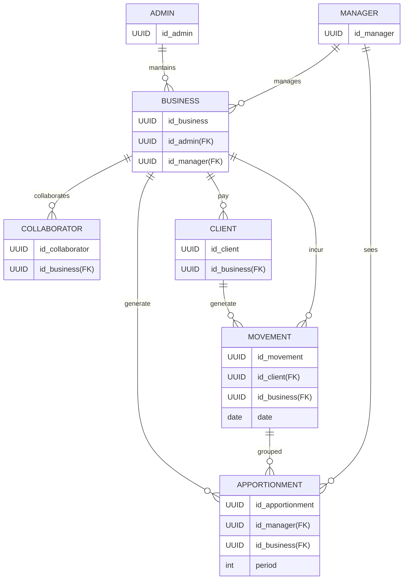
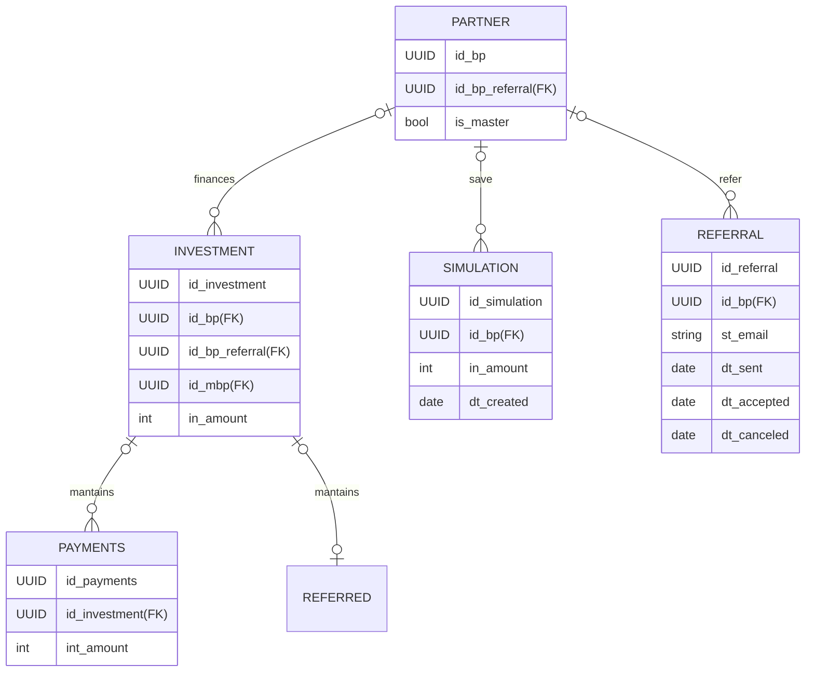

## Entity–relationship model · Business

```mermaid
erDiagram
    ADMIN ||--o{ BUSINESS : mantains
    BUSINESS ||--o{ COLLABORATOR : collaborates
    BUSINESS ||--o{ CLIENT : pay
    MANAGER ||--o{ BUSINESS : manages
    CLIENT ||--o{ MOVEMENT : generate
    BUSINESS ||--o{ MOVEMENT : incur
    BUSINESS ||--o{ APPORTIONMENT : generate
    MOVEMENT ||--o{ APPORTIONMENT : grouped
    MANAGER ||--o{ APPORTIONMENT : sees
    ADMIN {
        UUID id_admin
    }
    MANAGER {
        UUID id_manager
    }
    BUSINESS {
        UUID id_business
        UUID id_admin(FK)
        UUID id_manager(FK)
    }
    COLLABORATOR {
        UUID id_collaborator
        UUID id_business(FK)
    }
    APPORTIONMENT{ 
        UUID id_apportionment
        UUID id_manager(FK)
        UUID id_business(FK)
        int period
    }
    CLIENT {
        UUID id_client
        UUID id_business(FK)
    }
    MOVEMENT {
        UUID id_movement
        UUID id_client(FK)
        UUID id_business(FK)
        date date
    }
```

## Entity–relationship model · Partner

```mermaid
   erDiagram
    PARTNER |o--o{ INVESTMENT : finances
    PARTNER |o--o{ SIMULATION : save
    PARTNER |o--o{ REFERRAL : refer
    INVESTMENT |o--o{ PAYMENTS : mantains
    INVESTMENT |o--o| REFERRED : mantains
    PARTNER {
        UUID id_bp
        UUID id_bp_referral(FK)
        bool is_master
    }
    SIMULATION {
        UUID id_simulation
        UUID id_bp(FK)
        int in_amount
        date dt_created
    }
    INVESTMENT {
        UUID id_investment
        UUID id_bp(FK)
        UUID id_bp_referral(FK)
        UUID id_mbp(FK)
        int in_amount    
    }
    REFERRAL {
        UUID id_referral
        UUID id_bp(FK)
        string st_email
        date dt_sent
        date dt_accepted
        date dt_canceled
    }
    PAYMENTS {
        UUID id_payments
        UUID id_investment(FK)
        int int_amount
    }
```
