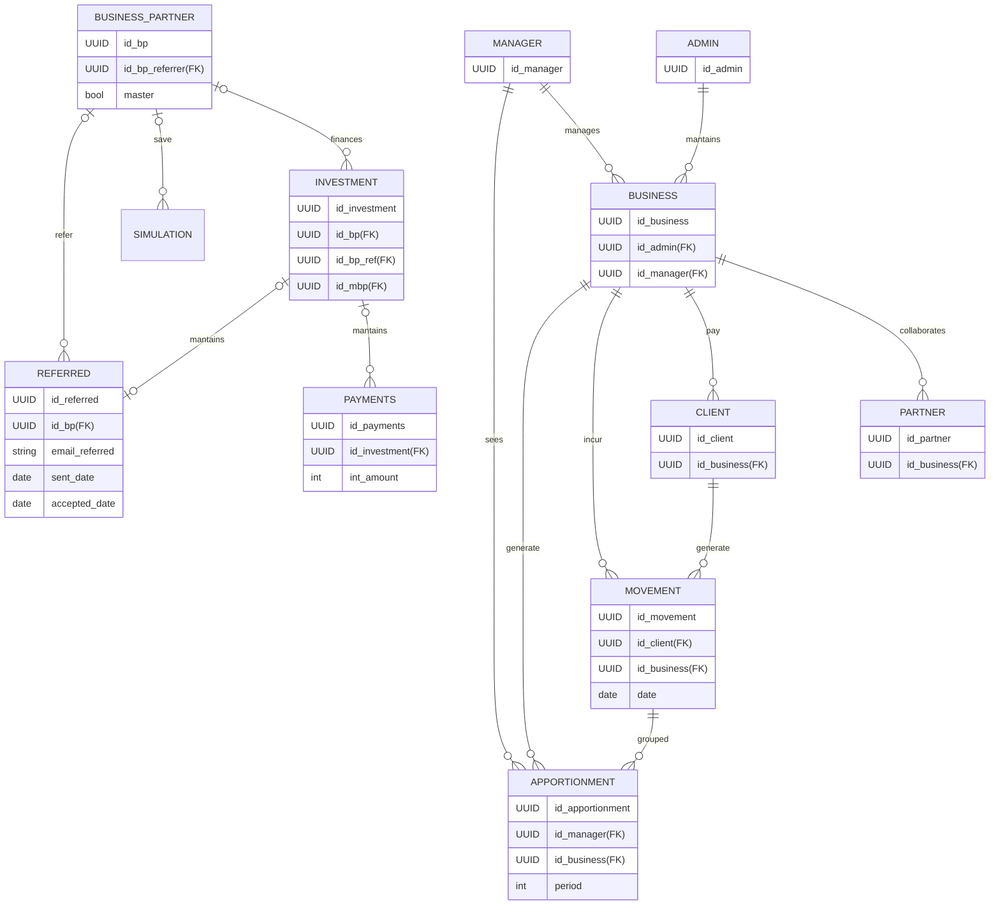

# Entity–relationship model

```mermaid
erDiagram
    ADMIN ||--o{ BUSINESS : mantains
    BUSINESS ||--o{ PARTNER : collaborates
    BUSINESS ||--o{ CLIENT : pay
    PARTNER
    MANAGER ||--o{ BUSINESS : manages
    CLIENT ||--o{ MOVEMENT : generate
    BUSINESS ||--o{ MOVEMENT : incur
    BUSINESS ||--o{ APPORTIONMENT : generate
    MOVEMENT ||--o{ APPORTIONMENT : grouped
    MANAGER ||--o{ APPORTIONMENT : sees
    ADMIN {
        UUID id_admin
    }
    MANAGER {
        UUID id_manager
    }
    BUSINESS {
        UUID id_business
        UUID id_admin(FK)
        UUID id_manager(FK)
    }
    PARTNER {
        UUID id_partner
        UUID id_business(FK)
    }
    APPORTIONMENT{ 
        UUID id_apportionment
        UUID id_manager(FK)
        UUID id_business(FK)
        int period
    }
    CLIENT {
        UUID id_client
        UUID id_business(FK)
    }
    MOVEMENT {
        UUID id_movement
        UUID id_client(FK)
        UUID id_business(FK)
        date date
    }
    
    BUSINESS_PARTNER |o--o{ INVESTMENT : finances
    BUSINESS_PARTNER |o--o{ SIMULATION : save
    BUSINESS_PARTNER |o--o{ REFERRED : refer
    INVESTMENT |o--o{ PAYMENTS : mantains
    INVESTMENT |o--o| REFERRED : mantains
    BUSINESS_PARTNER {
        UUID id_bp
        UUID id_bp_referrer(FK)
        bool master
    }
    INVESTMENT {
        UUID id_investment
        UUID id_bp(FK)
        UUID id_bp_ref(FK)
        UUID id_mbp(FK)
    }
    REFERRED {
        UUID id_referred
        UUID id_bp(FK)
        string email_referred
        date sent_date
        date accepted_date
    }
    PAYMENTS {
        UUID id_payments
        UUID id_investment(FK)
        int int_amount
    }

```
