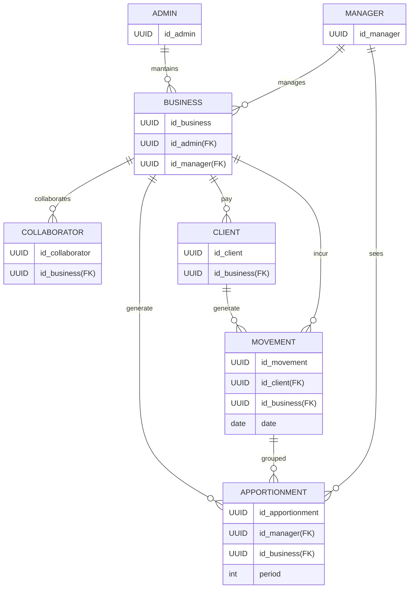

## Entity–relationship model · Business

```mermaid
erDiagram
    ADMIN ||--o{ BUSINESS : mantains
    BUSINESS ||--o{ COLLABORATOR : collaborates
    BUSINESS ||--o{ CLIENT : pay
    MANAGER ||--o{ BUSINESS : manages
    CLIENT ||--o{ MOVEMENT : generate
    BUSINESS ||--o{ MOVEMENT : incur
    BUSINESS ||--o{ APPORTIONMENT : generate
    MOVEMENT ||--o{ APPORTIONMENT : grouped
    MANAGER ||--o{ APPORTIONMENT : sees
    ADMIN {
        UUID id_admin
    }
    MANAGER {
        UUID id_manager
    }
    BUSINESS {
        UUID id_business
        UUID id_admin(FK)
        UUID id_manager(FK)
    }
    COLLABORATOR {
        UUID id_collaborator
        UUID id_business(FK)
    }
    APPORTIONMENT{ 
        UUID id_apportionment
        UUID id_manager(FK)
        UUID id_business(FK)
        int period
    }
    CLIENT {
        UUID id_client
        UUID id_business(FK)
    }
    MOVEMENT {
        UUID id_movement
        UUID id_client(FK)
        UUID id_business(FK)
        date date
    }
```

