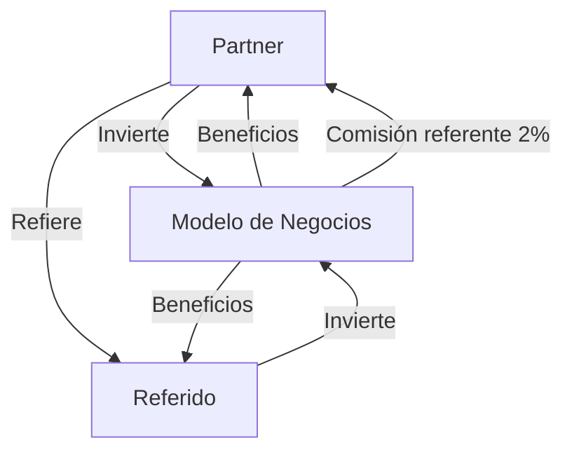
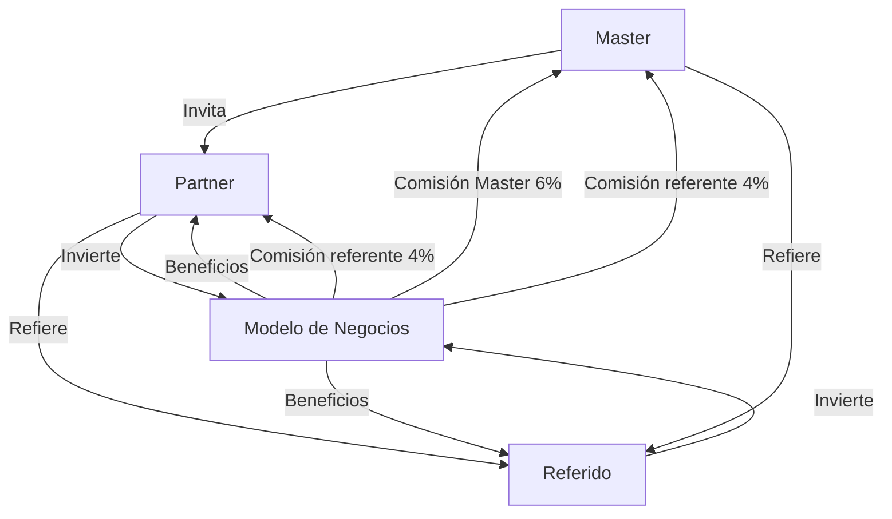

## Investment Flowchart

```mermaid
graph TD
    Partner[Partner]
    BM[Modelo de Negocios]
    Ref[Referido]

    Partner -- Invierte --> BM
    BM -- Beneficios --> Partner

    Partner -- Refiere --> Ref
    Ref -- Invierte --> BM
    BM -- Beneficios --> Ref
    BM -- Comisión referente 2% --> Partner
```

```mermaid
graph TD
    MBP[Master]
    Partner[Partner]
    BM[Modelo de Negocios]
    Ref[Referido]

    MBP -- Invita --> Partner
    Partner -- Invierte --> BM
    BM -- Beneficios --> Partner

    Partner -- Refiere --> Ref
    Ref -- Invierte --> BM
    BM -- Beneficios --> Ref
    BM -- Comisión referente 4% --> Partner

    MBP -- Refiere --> Ref
    BM -- Comisión Master 6% --> MBP
    BM -- Comisión referente 4% --> MBP
```
